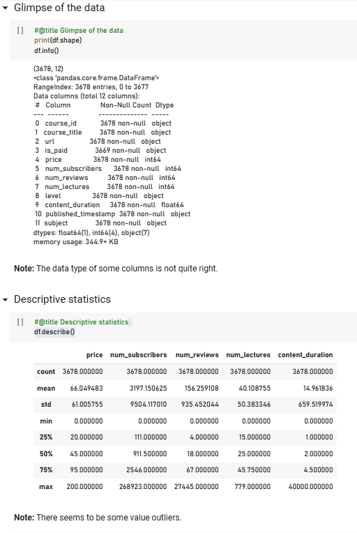
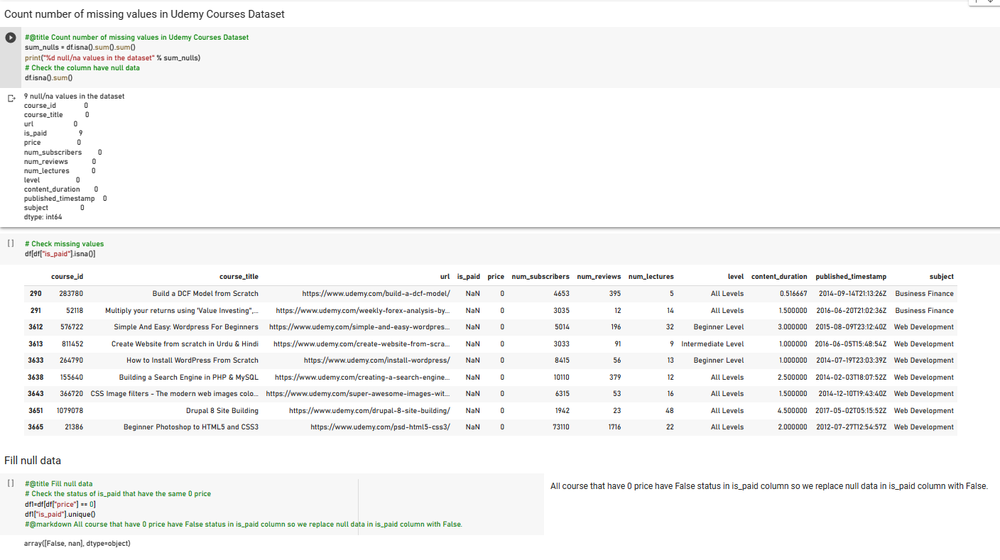
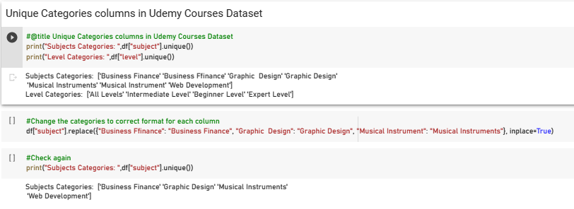
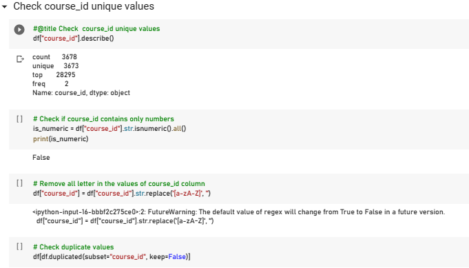

# Udemy Courses Analysis

You can see this on [Colab link](https://colab.research.google.com/drive/1F4TJbCf3uUChmQ66VyTCamWfllZObByO?usp=sharing)
---
## I. Introduction
The Udemy Courses Analysis dataset is a rich dataset that can be used to practice data cleaning, analysis, and visualization skills. The dataset is available online and contains data about Udemy courses. 
The dataset includes information such as course title, subject, level, duration, price, number of subscribers, number of reviews, and more
1.	Python concepts applied:
    + Read in data from online source.
    + Explore and clean data.
2.	SQL concepts applied:
    + Create database for the project, import csv file after clean.
    + Retrieve columns from a table, sort and filter query results.
3.	Power BI concepts applied:
    + Create some measure, visualization, build a report to find best courses.
## II. Data Sourcing
I receipt the csv file from stackholders. I open it with google sheet then publish to the web and put that link on Google Colab python to clean.
It cotain 1 sheet/table:
  + Udemy_course : 3678 rows and 12 columns
## III. Python Explore and clean data
1. Overview

2. Find missing data

 * All course that have 0 price have False status in is_paid column, so I replace null data in is_paid column with False.
3. Check Subject and Level categories then replace it with right class

4. Check the type of primary key column, Course_id 

5. Then check duplicate rows then drop them, and create file.csv
## IV. Continue with SQL queries in [README_SQL_PowerBI](https://github.com/LucasAnalyst/Udemy-Courses-Analysis/blob/main/README_SQL_PowerBI.md)
