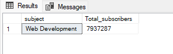

# Udemy Courses Analysis
* Udemy_courses.csv file [here](https://github.com/LucasAnalyst/Udemy-Courses-Analysis/blob/main/2.%20Udemy_courses.csv)
* Udemy_courses_SQL file [here](https://github.com/LucasAnalyst/Udemy-Courses-Analysis/blob/main/3.%20UDEMY_COURSES_SQL.sql)
---
## IV. Continue with SQL queries
1. Connect my databases then import csv flat file csv as Udemy_courses name, then perform some queries to answer a few questions

The SQL queries        |The results
:----------------------|---------------------------:
/*Q1. The top 1 subject with the most number of subscribers*/|  
/*Q2. The courses that have the most Revenue*/  |  
/*Q3. Top 10 courses have high total subcribers*/  |  
/*Q4. The 10 courses with the fewest reviews and their subscribers*/ |  
/*Q5. The 5 highest revenue courses out of the 10 courses with the highest subscribers*/  |  

