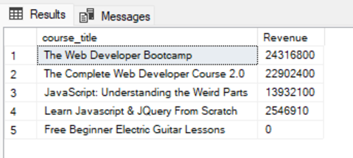

# Udemy Courses Analysis
* Udemy_courses.csv file [here](https://github.com/LucasAnalyst/Udemy-Courses-Analysis/blob/main/2.%20Udemy_courses.csv)
* Udemy_courses_SQL file [here](https://github.com/LucasAnalyst/Udemy-Courses-Analysis/blob/main/3.%20UDEMY_COURSES_SQL.sql)
---
## IV. Continue with SQL queries
1. Connect my databases then import csv flat file csv as Udemy_courses name, then perform some queries to answer a few questions
2. The results

### The SQL questions and The results

/*Q1. The top 1 subject with the most number of subscribers*/

 

/*Q2. The courses that have the most Revenue*/

/*Q3. Top 10 courses have high total subcribers*/ 

/*Q4. The 10 courses with the fewest reviews and their subscribers*/

/*Q5. The 5 highest revenue courses out of the 10 courses with the highest subscribers*/ 

## V. Visualization with Power BI
* Power BI file [here](https://github.com/LucasAnalyst/Udemy-Courses-Analysis/blob/main/4.%20PowerBI_Udemy_Courses.pbix)
### Create visualizations of Udemy courses data

The reports comprises 2 pages:
+ Overview 
+ Summary

Features:
* The Overview page presents basic information about Udemy courses such as 
  name of subjects, the level, total of courses by time(Year or month), paid status, total subscribers, revenue, average duration.
* The Summary page is used to summarize which is the best course and make a few comparisons to confirm that conclusion.

1. The Overview page:

* Create some measure to calculate revenue, percentage of paid status, and average of duration values.
* Create hierarchy for Year and month data then build line chart display Total courses and subscribers by year and month.
* Use Zscore to remove the outliers from duration column.

     The average of duration values is change from 15.02 to 4.09 after remove outliers.

* Pick some filter to find insights.

Musical Instrusment | Web Development
:-------------------|-------------------:
|
 |
    
2. The Summary page:

* Create a line chart to see the duration that have the highest subscribers.
* Use Mutil-row card chart with condition to see total subscribers, paid percent for each subjects and level.

Musical Instrusment | Web Development
:-------------------|-------------------:
|

## VI. Conclusion and Recommendation

### If we want to open a course on Udemy. 
  
* Best option: Web Development for All level/Beginner level with duration time is 1,5 to 2 hours. The course will bring you the most subscribers and revenue. 
* Another option: 
  + Business Finance for All level with duration time is 1 to 1,5 hours.
  + Graphic Design for Beginner level with duration time is 1 or 2.5 hours
  + Musical Instruments for Beginner level with duration time is 1.5 or 4.5 hours.

**Note:** This recommendation is base on Udemy course data that was collected from 2011 to 2017.

